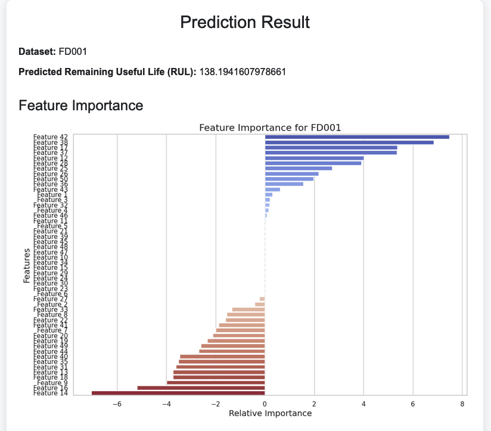
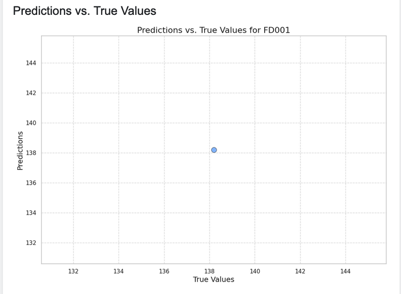
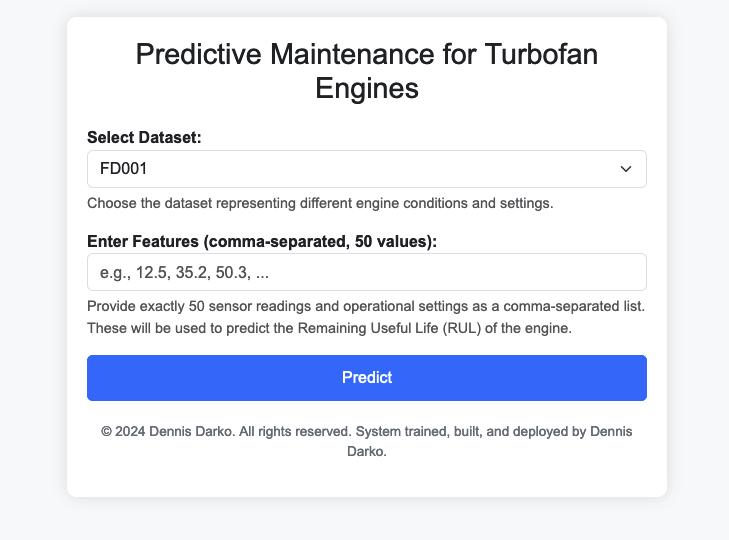

# **Predictive Maintenance for Turbofan Engines** 

  

## **Project Overview** 

  

This project focuses on building a predictive maintenance model for turbofan engines, an essential component in aviation and various industrial applications. By accurately predicting the Remaining Useful Life (RUL) of these engines, the project aims to optimize maintenance schedules, reduce downtime, and prevent costly failures. 

  

The project integrates machine learning techniques with a Flask web application, providing a user-friendly interface for predictions and visualizations. The application is containerized using Docker and deployed on Google Cloud Run, ensuring scalability and reliability. Additionally, the project incorporates Continuous Integration and Continuous Deployment (CI/CD) practices using GitHub Actions to automate the testing, building, and deployment processes, aligning with industry standards. 

  

## **Key Features** 

  

1. **Predictive Modeling:** 

   - Predicts the Remaining Useful Life (RUL) of turbofan engines using different datasets (FD001, FD002, FD003, FD004). 

   - Provides an intuitive web interface for users to interact with the model. 

  

2. **Feature Importance Analysis:** 

   - Visualizes the importance of each feature (sensor readings and operational settings) in the predictive model. 

   - Helps users understand which factors most significantly influence engine health. 

   

3. **CI/CD Pipeline:** 

   - Automates the build, test, and deployment process using GitHub Actions. 

   - Ensures consistent quality and rapid iteration through continuous integration and deployment to Google Cloud Run. 

  

## **Project Objectives** 

  

- **Enhance Predictive Maintenance:** Develop a model that accurately predicts when a turbofan engine is likely to fail, enabling proactive maintenance. 

- **User-Friendly Interface:** Provide a web-based tool that makes complex machine learning predictions accessible to users with varying technical expertise. 

- **Transparent Modeling:** Offer insights into the model’s decision-making process through visualizations, making the tool more trustworthy and easier to interpret. 

- **Industry-Standard Deployment:** Implement CI/CD practices to automate deployment, ensuring the application is always up-to-date and reliable. 

  

## **Methodology** 

  

### **1. Data Processing** 

   - **Source:** Utilized the C-MAPSS datasets from the NASA Prognostics Data Repository, containing multivariate time-series data from turbofan engines under various conditions. 

   - **Processing:** Cleaned and preprocessed the data to extract relevant features, which were then used to train the predictive models. 

  

### **2. Model Training** 

   - **Approach:** Trained linear regression models using scikit-learn, tailored to each specific dataset (FD001, FD002, FD003, FD004). 

   - **Validation:** The models were rigorously tested and validated to ensure they could accurately predict the Remaining Useful Life (RUL) of the engines. 

  

### **3. Web Application Development** 

   - **Framework:** Built the web application using Flask, providing a simple and intuitive interface for users to interact with the model. 

   - **Features:** Users can select a dataset, input features, and receive predictions. The app also includes visualizations that display feature importance and prediction accuracy. 

  

### **4. Visualization and Analysis** 

   - **Feature Importance:** Generated bar charts to show which features have the greatest impact on the RUL predictions. 

   - **Predictions vs. True Values:** Created scatter plots and line plots to compare the model's predictions against the actual RUL values, with an ideal prediction line for reference. 

  

### **5. Deployment** 

   - **Docker:** Containerized the application using Docker, making it easy to deploy across different environments. 

   - **Google Cloud Run:** Deployed the application to Google Cloud Run for scalable and reliable operation. 

   - **CI/CD Pipeline:** Integrated GitHub Actions for continuous integration and deployment, automating the build, test, and deployment process. This ensures that the latest version of the application is always live. 

  

## **Results and Insights** 

  

### **Feature Importance with prediction results** 

   - The feature importance plot illustrates which factors most significantly affect the model’s predictions. Features with higher importance values are critical in determining the Remaining Useful Life of the engine. 

    

### **Feature Importance**  

- The feature importance plot illustrates which factors most significantly affect the model’s predictions. Features with higher importance values are critical in determining the Remaining Useful Life of the engine.  

 

 

### **Prediction Accuracy** 

   - The predictions vs. true values plot provides a clear visual representation of the model’s performance. It allows users to see how closely the predictions align with actual outcomes, with a line indicating perfect predictions for comparison. 

 

  

### **User Interface** 

   - The web application’s user interface is designed to be intuitive and user-friendly. Users can easily input data, view results, and understand the model’s outputs through clear visualizations. 

    

  

### **CI/CD Pipeline** 

   - The CI/CD pipeline implemented using GitHub Actions automates the process of testing, building, and deploying the application. This ensures that every code change is automatically tested and deployed, reducing manual effort and minimizing the risk of errors. 

  

## **Technology Stack** 

  

- **Programming Language:** Python 

- **Web Framework:** Flask 

- **Machine Learning:** scikit-learn 

- **Data Visualization:** Matplotlib, Seaborn 

- **Containerization:** Docker 

- **Deployment Platform:** Google Cloud Run 

- **CI/CD:** GitHub Actions 

  

## **Installation and Deployment** 

  

### **Local Installation** 

  

1. **Clone the repository:** 

   ```bash 

   git clone https://github.com/yourusername/my_project.git 

   cd my_project 

2. **Create a virtual environment and activate it:** 

   ```bash 

   python3 -m venv venv 

   source venv/bin/activate 

3. **Install the dependencies:** 

   ```bash 

   pip install -r requirements.txt 

4. **Run the application:** 

   ```bash 

   python app.py 

  

   Open a web browser and go to http://localhost:8080 

  

## **Docker Deployment** 

  

1. **Build the Docker image:** 

   ```bash 

   docker build -t turbofan-predictor . 

2. **Run the Docker container:** 

   ```bash 

   docker run -p 8080:8080 turbofan-predictor 

  

## **CI/CD Pipeline Deployment** 

  

1. **Configure GitHub Actions:** 

   The repository includes a GitHub Actions workflow that automates testing, building, and deploying the application to Google Cloud Run. 

   Ensure your Google Cloud credentials are set up in the GitHub repository's secrets for seamless deployment. 

  

2. **Push Changes:** 

   Every push to the 'main' branch triggers the CI/CD pipeline, which tests the code, builds the Docker image, and deploys the application to Google Cloud Run. 

  

3. **Monitor Deployment:** 

   Monitor the deployment status directly in the GitHub Actions tab of your repository. 

  

## **Conclusion** 

  

This project showcases a complete pipeline for predictive maintenance, from data preprocessing and model training to deployment and user interaction. By integrating a CI/CD pipeline, the project aligns with industry standards for continuous integration and delivery, making the application reliable and scalable. The detailed visualizations provide valuable insights into model performance, making this project a strong example of applied machine learning in a real-world scenario. 

  

## **Acknowledgments** 

  

This project is based on data from the NASA Prognostics Data Repository. 

Special thanks to the authors of the C-MAPSS datasets for their contributions to predictive maintenance research. 

  

## **Contact** 

  

For further inquiries or collaboration opportunities, please contact me at dennisdarko0909@gmail.com. 
